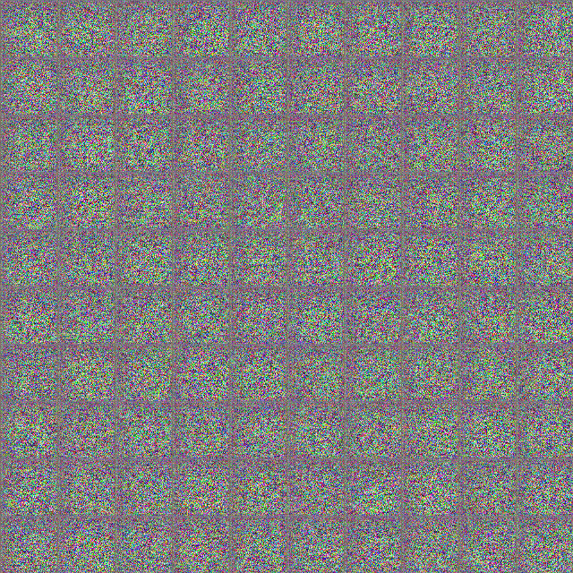
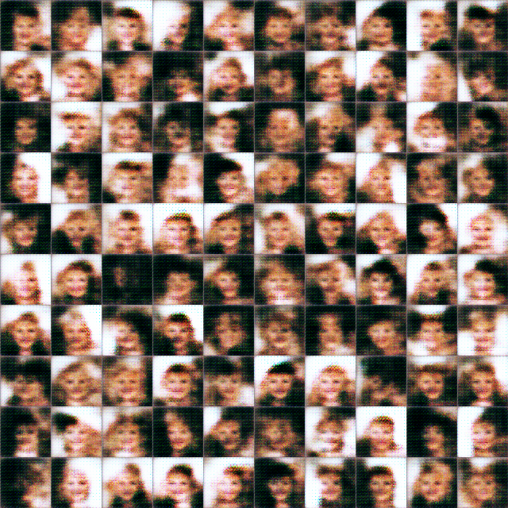
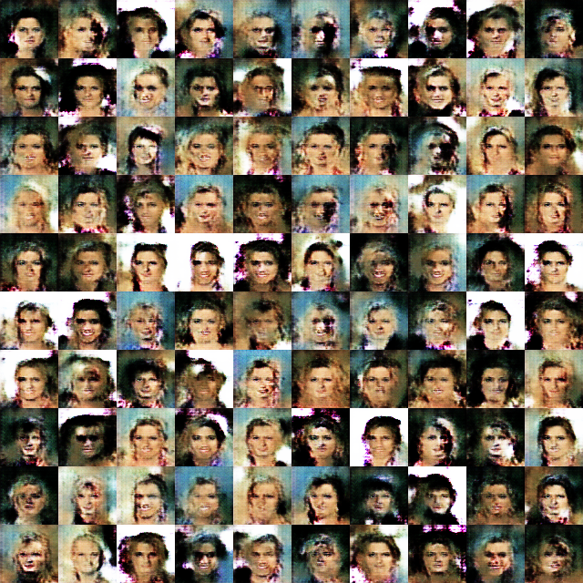
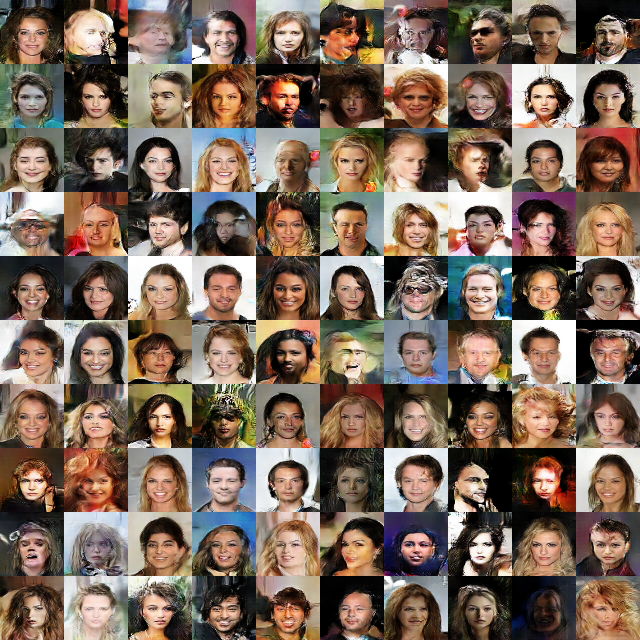
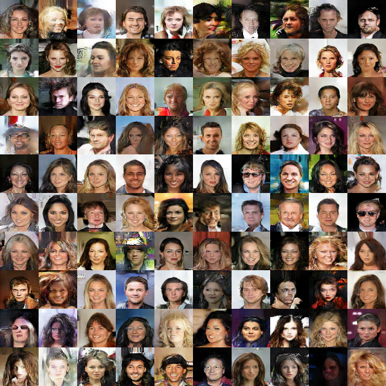
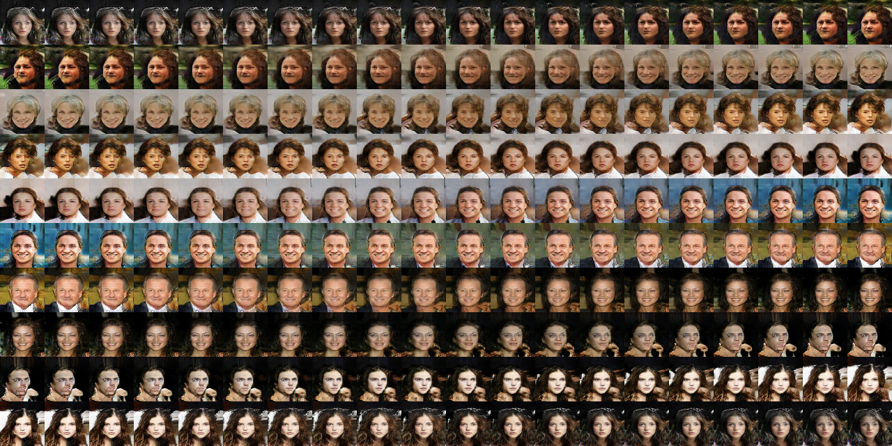

GAN_facialGeneration_64pixel
============================
用GAN生成人脸

运行gan_new.ipynb即可开始训练网络

# 上手指南
以下指南将帮助你在本地机器上安装和运行该项目，进行开发和测试。

## 安装要求
* nvidia显卡
* CalebA人脸数据集
* python3
* 一些python库
  * tensorflow-gpu(我使用的是1.12版本) 
  pip3 install --index-url http://pypi.douban.com/simple --trusted-host pypi.douban.com --upgrade tensorflow-gpu==1.12
  * matplotlib(绘图) 
  pip3 install --index-url http://pypi.douban.com/simple --trusted-host pypi.douban.com --upgrade matplotlib
  * jupyter(非必须) 
  pip3 install --index-url http://pypi.douban.com/simple --trusted-host pypi.douban.com --upgrade jupyter
  * Pillow 
  pip3 install --index-url http://pypi.douban.com/simple --trusted-host pypi.douban.com --upgrade Pillow
* cuda、cudnn(与tensorflow-gpu所对应的版本)

## 安装步骤
略

# 测试
## 训练模型
> 这里使用的人脸训练集是CalebA人脸数据集。 
> [CalebA人脸数据集](http://mmlab.ie.cuhk.edu.hk/projects/CelebA.html) 是香港中文大学的开放数据，包含10,177个名人身份的202,599张人脸图片，并且都做好了特征标记，这对人脸相关的训练是非常好用的数据集。 
> 将其中的img_align_celeba.zip解压，得到一个包含202,599张人脸图片的文件夹，为了凑个整，你可以把自己的照片放进去(不需要修改图片和图片名称)。 
> 打开 main.py。 
> 修改其中的 image_path 参数为你的人脸数据集目录。 
> 然后运行 main.py，开始训练。 
> 你可以随时终止运行，在运行的过程中会自动保存网络，保存路径为./my_net/。 
训练过程中部分图片如下：(展示的分别是第1次，第101次，第1001次，第18001次，第72001次训练结果) 

## 生成gif图
* 原理
> gan网络中有两个神经网络：鉴别网络和生成网络。生成网络是根据一个N维向量生成的人脸，在训练时，我们随机生成这个N维向量。 
> 这个N维向量即是一个N维空间中的一个点，所以N维空间中每一个点就是一个人脸。若a脸对应于A点，b脸对应于B点，那么我们连接A、B两点，从A点出发走向B点，就可以得到由a脸逐渐变化为b脸。 
> 这里我们生成的是上图倒数第三列的人脸变化的gif图。 
* 实现
> 运行showimg.py，在testimg目录下生成了一个gif图 
gif图如下： 
 
gif的每一帧： 
 

* 问题
> 在利用训练好的网络生成图片时发现了一个问题，生成的图片质量很不好，即使使用和示例图片相同的随机初始向量也依然如此。 
> 是因为训练时我们每次给生成网络喂食100个随机初始向量，然后其生成100张人脸。 
> 所以生成图片时必须使随机初始向量接近于100个，并且尽量随机。 
> 当我想生成从A脸到B脸过渡的图片时，其每个初始向量在一条线上，不是随机分布的。 
> 所以我们取10个我们所需的初始向量，再加上90个随机初始向量，凑成100个符合要求的随机初始向量，再取结果的前10张图片。 
# 版本控制
版本控制是什么？

# 作者
此处留空，不敢自称作者

# 版权说明
无

# 鸣谢
该项目参考于阿里云天池课堂中的代码，源代码是生成手写数字。 
感谢以下项目： 
* https://github.com/soumith/ganhacks
* https://github.com/carpedm20/DCGAN-tensorflow 
感谢女友的支持和陪伴（话说我哪来的女友）

